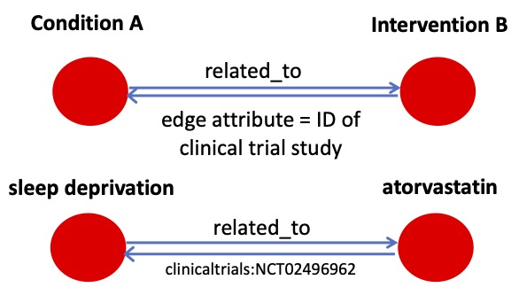

# Multiomics KP for Clinical Trials

The Multiomics KP for Clinical  Trials is created and maintained by the Multiomics Provider team from the Institute for Systems Biology in Seattle, WA. We extracted, transformed, and loaded (ETL) information from Aggregate Content of ClinicalTrials.gov (AACT), a publicly available database that hosts protocol and result information from ClinicalTrials.gov. 

[Aggregate Content of ClinicalTrials.gov (AACT)](https://aact.ctti-clinicaltrials.org/)

This KP is in the initial development phase and currently supports 1-hop querying. A question that may be posed to the current version of this KG is: What interventions have been clinically trialed for a given condition/disease? The edge attribute returned for the query include the NCT ID, which is the unique identifier for the study for the intervention and condition/disease in question.

### Graph Representation

